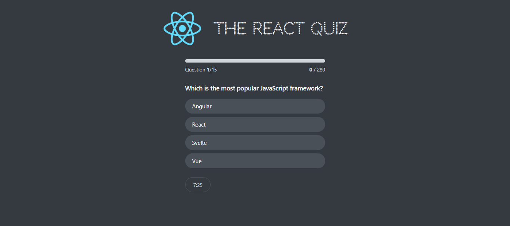

## 🌟 The React Quiz 🌟

Test your knowledge with **The React Quiz**, a fun and dynamic quiz application built with React! From fetching questions to tracking your progress, this app is packed with features to make learning enjoyable and rewarding. 🧠✨

---

## 📸 Screenshot



---

## 🔗 Links

- Github Repo: [Github-link](https://github.com/Mikiyas6/React-Quiz)
- Live Site URL: [Page-link](https://mike-react-quiz-app.netlify.app/)

---

## 📋 Table of Contents

- [🚀 Features](#-features)  
- [🔧 Installation](#-installation)  
- [🎮 How to Play](#-how-to-play)  
- [⚙️ State Management](#️-state-management)  
- [📚 Components](#-components)  
- [🌐 API](#-api)  
- [🎨 Customization](#-customization)  
- [💡 Future Improvements](#-future-improvements)  
- [📜 License](#-license)  

---

## 🚀 Features  

- **🖥️ Dynamic Questions:** Questions are fetched in real time from an external API.  
- **💾 Centralized State:** Uses `useReducer` for managing application states efficiently.  
- **📊 Progress Tracker:** Keep tabs on your current progress and points earned.  
- **⏳ Timer:** Answer each question within the given time limit!  
- **🏆 High Score Tracking:** Push yourself to achieve new high scores.  
- **⚠️ Error Handling:** Gracefully handles any issues with fetching data.  
- **📱 Responsive Design:** Optimized for screens of all sizes.  

---

## 🔧 Installation  

1. **Clone the repository:**  
   ```bash  
   git clone https://github.com/your-username/the-react-quiz.git  
   ```  

2. **Navigate to the project directory:**  
   ```bash  
   cd the-react-quiz  
   ```  

3. **Install the dependencies:**  
   ```bash  
   npm install  
   ```  

4. **Start the development server:**  
   ```bash  
   npm start  
   ```  

---

## 🎮 How to Play  

1. **Start the Application:**  
   Launch the app at `http://localhost:3000`.  

2. **Ready, Set, Quiz!**  
   - You’ll see a start screen with the number of questions. Click **Start** to begin.  
   - Each question comes with multiple options. Select the correct one before time runs out!  

3. **Track Your Progress:**  
   - Points are awarded for correct answers.  
   - A progress bar and timer guide you throughout the quiz.  

4. **Finish Strong:**  
   - At the end, view your final score and high score!  

5. **Restart Anytime:**  
   - Missed some questions? Hit restart to play again!  

---

## ⚙️ State Management  

The application uses **`useReducer`** for state management, ensuring consistent updates and predictable behavior.  

### Application States  
- **`loading`**: Fetching quiz questions.  
- **`error`**: API request failed.  
- **`ready`**: Questions loaded; the quiz is ready to start.  
- **`active`**: Quiz in progress.  
- **`finished`**: Quiz completed.  

### Actions  
| Action          | Description                                              |  
|------------------|----------------------------------------------------------|  
| `dataReceived`   | Updates state with questions and sets status to `ready`. |  
| `dataFailed`     | Handles errors when fetching fails.                      |  
| `start`          | Starts the quiz and initializes the timer.              |  
| `newAnswer`      | Saves the selected answer and updates points.            |  
| `nextQuestion`   | Moves to the next question.                              |  
| `finished`       | Marks the quiz as completed.                             |  
| `restart`        | Resets the quiz while keeping the high score.            |  
| `tick`           | Decreases remaining time and auto-finishes if time ends. |  

---

## 📚 Components  

### 1. **Header**  
   - Displays the app title.  

### 2. **Loader** 🌀  
   - Shown when questions are being fetched.  

### 3. **Error** ⚠️  
   - Renders an error message if fetching fails.  

### 4. **StartScreen** 🏁  
   - Displays quiz info and a start button.  

### 5. **Question** ❓  
   - Shows the current question and options.  

### 6. **Progress** 📊  
   - Displays current progress, points, and total score.  

### 7. **Timer** ⏳  
   - Counts down the remaining time for the quiz.  

### 8. **NextButton** ➡️  
   - Moves to the next question after answering.  

### 9. **FinishScreen** 🏆  
   - Shows the final score, high score, and an option to restart.  

---

## 🌐 API Setup  

The questions are fetched from a server you create yourself using a `questions.js` file. Here's how to set it up:  

### 1. Create a Local JSON Server  
This application uses **`json-server`** to serve the questions.  

1. **Install `json-server`:**  
   ```bash  
   npm install -g json-server  
   ```  

2. **Create the `questions.js` File:**  
   Inside the project folder, create a `questions.js` file and add the following:  
   ```json  
   [  
     {  
       "id": 1,  
       "question": "What is the capital of France?",  
       "options": ["Paris", "London", "Berlin", "Madrid"],  
       "correctOption": 0,  
       "points": 10  
     },  
     {  
       "id": 2,  
       "question": "Which planet is known as the Red Planet?",  
       "options": ["Earth", "Mars", "Venus", "Jupiter"],  
       "correctOption": 1,  
       "points": 10  
     }  
   ]  
   ```  

3. **Run the JSON Server:**  
   Use the following command to start the server:  
   ```bash  
   json-server --watch questions.js --port 8000  
   ```  

4. **Confirm the Server is Running:**  
   Open your browser and visit `http://localhost:8000/questions` to see the questions in JSON format.  

### 2. Update the Fetch URL  
The application already fetches questions from `http://localhost:8000/questions`. Ensure your server runs on the same port.  

---

## 🎨 Customization  

- **Adjust Time Per Question:**  
  Change the `SECS_PER_QUESTION` constant to modify the time limit.  

- **Use a Different API:**  
  Replace the fetch URL in the `useEffect` hook to use a different API.  

- **Change Points System:**  
  Modify the `newAnswer` action logic in the reducer to adjust scoring rules.  

- **Styling:**  
  Update the CSS to fit your preferred theme or design style.  

---

## 💡 Future Improvements  

- **🔐 User Profiles:** Save scores with user authentication.  
- **🎯 Difficulty Levels:** Allow users to choose quiz difficulty.  
- **📋 Question Categories:** Add options for specific topics.  
- **🌍 Leaderboard:** Compare scores with other users globally.  
- **🎨 Enhanced Animations:** Improve UI/UX with smooth transitions.  


